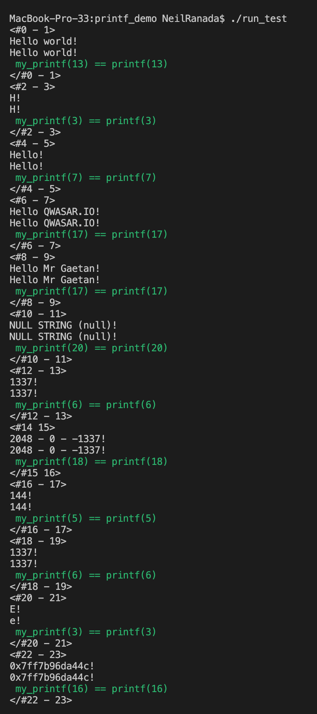

# Welcome to Printf Demo
***

## Task
This project replicates the `printf()` C standard library function to understand its inner workings.

## Description
The development of this command-line application is broken down into two major parts:
1. Primary functions for converting various data types (character, string, signed integer, unsigned integer, octal, hexadecimal, memory address) based on their associated flags in the C language (`%c`, `%s`, `%d`, `%u`, `%o`, `%x`, `%p`)
2. Helper functions such as changing decimal numbers into octal or hexadecimal formats

## Installation
Steps:
1. You can download the project folder and files manually to your computer or fork the Github repo at:
https://github.com/Ranada/printf_demo
2. Or through your terminal, clone this repository: `git clone https://github.com/Ranada/printf_demo`
3. Go to the directory containing this project: `cd printf_demo`
4. Check to see if you have a GCC compiler installed: `gcc --version` (if not installed, consider using Homebrew method: https://formulae.brew.sh/formula/gcc)
5. Compile automatically using the included makefile using `make` or manually `gcc -Wall -Wextra -Werror *.c -o run_test`

## Usage
1. Use the `test_cases.c` file included with this project. Or add your C file with test functions and include `#include "printf_demo.h"` and `#include <stdio.h>` at the top of your file.
2. Compile automatically using the included makefile using `make` or manually `gcc -Wall -Wextra -Werror *.c -o run_test`
3. Run the program `./run_test`

Note: If you receive error messages for one or more of your test cases, comment out `//` the test function(s) in question and then try to compile with `make` and run the program again `./run_test`

### Screenshot of expected command line output from using test_cases.c

## Takeaways and Lessons Learned
I learned the printf function in the C library handles numerous conversions of various data types (integer, character, string, memory address) "under the hood" before printing to the command line. Before printing, some math is required to convert from decimal to octal or hexadecimal formats.

## Final thoughts
After completing this C project, I find using librarian functions and methods in higher-level programming languages such as Javascript and Ruby less mysterious. I'm more comfortable looking up documentation to understand these built-in solutions.

## Have recommendations? Want to chat about programming and other good stuff? Let's connect.
neil.ranada@gmail.com  
https://www.linkedin.com/in/neilranada/

### The Core Team
Neil Ranada, Software Engineer

<i>Made at <a href='https://qwasar.io'>Qwasar Silicon Valley</a></i>

